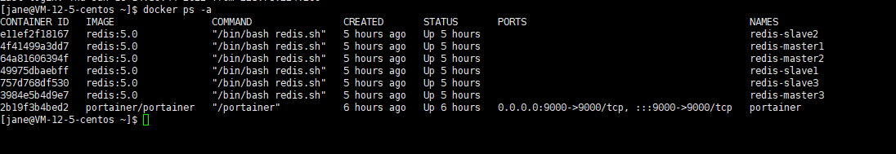
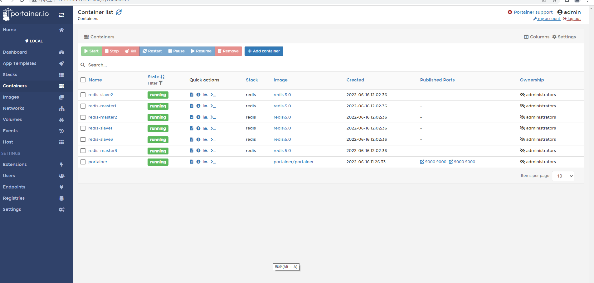
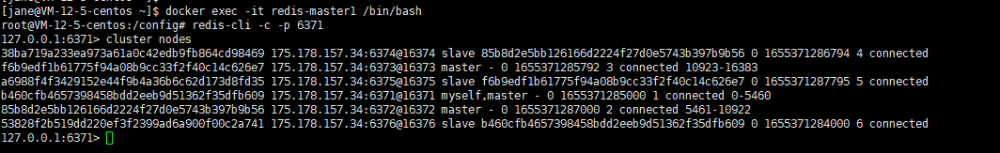
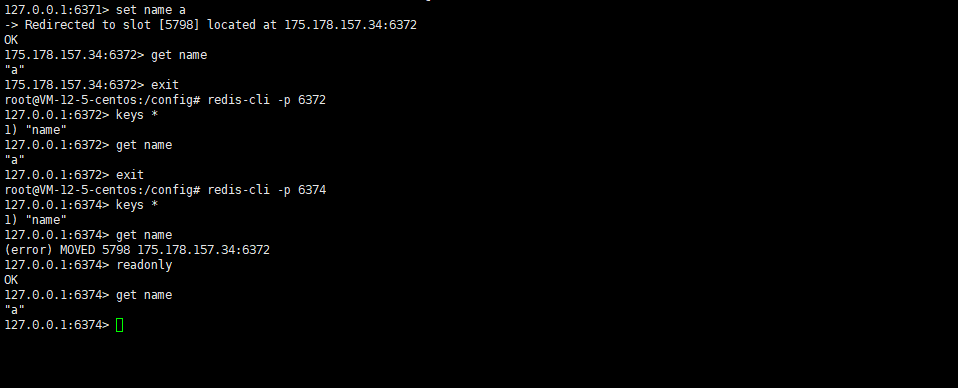
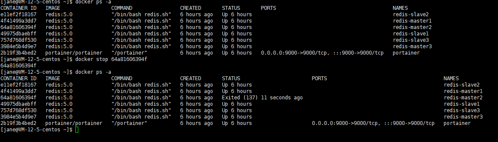
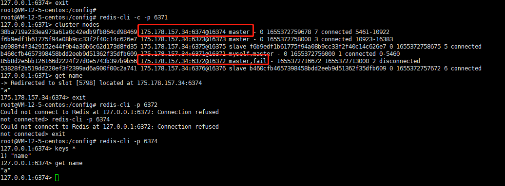

<h3>
RedisCluster集群搭建测试
</h2>

#### 1、环境准备

- CentOS安装Docker

	[Linux下安装 Docker实例](https://www.linuxprobe.com/linux-setup-docker.html)

- CentOS部署portainer(可选)  

	[Connect Local报错](https://blog.csdn.net/peng2hui1314/article/details/109742299)

- CentOS安装Python3.9、Pip    

	[Centos7卸载Python2.7.5&安装Python3.9.0的方法](https://blog.csdn.net/noamanelson/article/details/117708164)

- Pip安装docker-compose

	[Pip安装docker-compose报错](https://blog.csdn.net/weixin_48302334/article/details/124297616)

- docker-compose安装RedisCluster

	[使用Docker搭建Redis三主三从集群](http://t.zoukankan.com/fdzang-p-14542012.html)  
	[network_mode、ports配置冲突](https://blog.csdn.net/weixin_43687313/article/details/123790438)  

	其他注意事项:  
	1、注意在防火墙或者安全组开启端口6371-6376、16371-16376  
	2、开启端口后记得重启Docker  

#### 2、搭建成功

  

     
  
  
 
注意:  
主从关系并不是docker-compose.yaml里面slave1对应master1，slave2对应master2，slave3对应master3。从cluster nodes看出
主一6371从六6376 主二6372从四6374 主三6373从五6375。

#### 3、测试

- 测试主从同步和数据分片

	1.  设置key name value a (写入主二6372)  
	2.  集群查询name  
	3.  单机登录主二6372查询name  
	4.  单机登录从二6374查询key
	5.  单机登录从二6374查询name

注意：  
RedisCluster集群中的从节点，官方默认设置的是不分担读请求的、只作备份和故障转移用,当有请求读向从节点时，会被重定向对应的主节点来处理。  
参考[redis cluster中从节点读取不了数据(error) MOVED](https://blog.csdn.net/yabingshi_tech/article/details/115573330)   

- 测试主备切换
 
关闭主二6372
>docker stop 64a81606394f   

   

登录集群
>redis-cli -c -p 6371  

查看集群状态
>cluster nodes    

发现从二6374已经变成主节点 

查询key name
>get name

集群依然可用

退出  
>exit

单机登录主二6372 连接不上
>redis-cli -p 6372  

Could not connect to Redis at 127.0.0.1:6372: Connection refused

退出  
>exit

单机登录从二6374
>redis-cli -p 6374

查询 key name

>get name  

#### 4、总结

Redis三种集群模式:主备、哨兵、节点。    
主机宕机情况下，主备模式无法自动切换。  
哨兵引入了sentinal，在主机宕机情况下,可以由sentinal选取新的主机实现自动主备切换。缺陷在于，主机写入的性能瓶颈。  
Cluster节点集群，实现了数据分片。每个主机都可以写入数据，并同步给从服务器。当主服务器宕机时，从服务器自动转为主服务器。解决了写入性能瓶颈问题，同时支持动态伸缩。