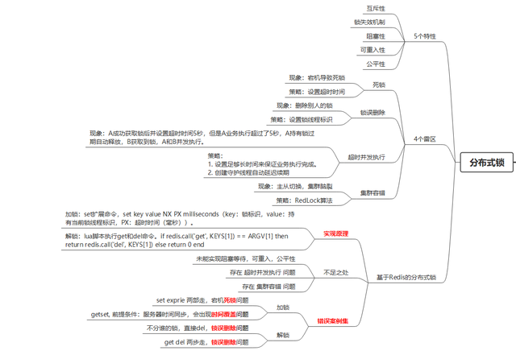

<h3>
Redisson实现分布式锁
</h2>

#### 1、前言
  
在某些场景中，多个进程必须以互斥的方式独占共享资源，这时用分布式锁是最直接有效的。  
随着技术快速发展，数据规模增大，分布式系统越来越普及，一个应用往往会部署在多台机器上（多节点），在有些场景中，为了保证数据不重复，要求在同一时刻，同一任务只在一个节点上运行，即保证某一方法同一时刻只能被一个线程执行。在单机环境中，应用是在同一进程下的，只需要保证单进程多线程环境中的线程安全性，通过 JAVA 提供的 volatile、ReentrantLock、synchronized 以及 concurrent 并发包下一些线程安全的类等就可以做到。而在多机部署环境中，不同机器不同进程，就需要在多进程下保证线程的安全性了。因此，分布式锁应运而生。

#### 2、分布式锁知识图谱

#### 2、底层实现原理

判断key是否存在，不存在则设置key的值为value，原子性。 
 
>setnx key value

设置key的值为value，过期时间为seconds，原子性。

>setex key seconds value

reddission底层通过这两个命令结合lua脚本完成redis分布式锁。

#### 3、Redisson API介绍

-   boolean tryLock(long time, TimeUnit unit) throws InterruptedException;

尝试获取锁，并设置锁有效时间。成功返回true，失败返回false。获取成功后，会有一个看门狗线程定时轮询锁是否释放，如果未释放，会重新设置有效期。保证锁在业务处理完后释放，没有并发问题。

- boolean tryLock(long waitTime, long leaseTime, TimeUnit unit) throws InterruptedException

在waitTime范围内，不断尝试获取锁，并设置锁有效时间leaseTime。成功返回true，失败返回false。超过有效时间，锁会自动释放，即时业务没有处理完(不会重新设置锁有效期)。有并发问题。

- void unlock();

释放锁。

- boolean isLocked();

判断锁是否释放。如果使用boolean tryLock(long waitTime, long leaseTime, TimeUnit unit)，在调用unlock()之前，需要加上此判断，防止锁失效自动释放后，再调用unlock()抛出异常。

- boolean isHeldByCurrentThread();

判断锁是否被当前线程锁定。为了防止程序员在tryLock失败的情况下 调用unlock方法导致java.lang.IllegalMonitorStateException: attempt to unlock lock,not locked by current thread by node异常。在调用unlock()之前，需要加上此判断。

#### 4、源码解读

[Redis分布式锁-这一篇全了解(Redission实现分布式锁完美方案)](http://t.zoukankan.com/huangwentian-p-14622441.html) 

#### 5、缺陷与解决方案

当主节点写入key成功未同步到从节点时，主节点宕机。从节点切换成主节点，导致并发问题。

使用RedissonRedLock。对每一个节点加锁，半数以上的成功才算成功。

